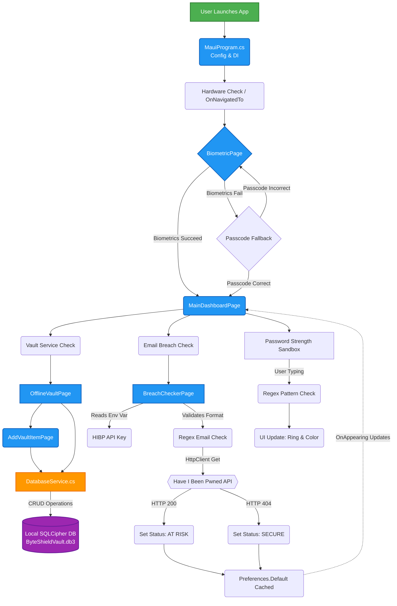

# 🛡️ ByteShield
**Digital Hygiene & Personal Security Mobile App**

**Tags:** Mobile App, Security, [](https://github.com/osman-builds/ByteShield/actions/workflows/build-android-release.yml)

ByteShield is a state-of-the-art mobile application built with .NET MAUI, aimed at safeguarding your personal digital identity. By prioritizing "Local-First" end-to-end encrypted storage, biometric authentication, and strict personal data hygiene, ByteShield ensures that you remain firmly in control of your digital footprint.

---

## 🌟 Key Features

### 1. Biometric Gatekeeper (Session Flow)
Security begins right at the front door. ByteShield locks the application behind a **Biometric Gatekeeper** (powered by `Plugin.Fingerprint`). Attempting to bypass this screen is impossible without successful fingerprint or facial identification, keeping unauthorized physical usage out of bounds.

### 2. Security Dashboard (Real-time Analysis)
The central Security Hub evaluates password robustness instantly. As you type, the **Password Strength Analyzer** dynamically adjusts:
- Interactive radial gauge scoring your input from `0` to `100`.
- Real-time cryptographic feedback checking against length, casing, numerical, and symbolic markers.
- Visibility toggling and visual color-coded hazard states to ensure strong credential generation.

### 3. Premium Offline Vault (Encrypted Storage)
Your personal credentials deserve premium protection. The **Offline Vault** stores your account handles and passwords securely on your device using a robust local SQLite implementation (`sqlite-net-sqlcipher`).
* **Zero Cloud Tracking:** Data never transits a remote backend server; your data never leaves this device.
* **Full CRUD Management:** Easily Add, Edit, Delete, and Reveal passwords using native, action-driven sheets.

### 4. Breach Checker (Identity Audit)
An interactive Identity Audit page simulating connection hooks using HaveIBeenPwned endpoints. It takes an email address and verifies its integrity against known public data leak domain registries, providing immediate threat intelligence metrics.
*   **Leak Source Display:** Provides a clear readout of exact domain networks or registries where your email was intercepted.
*   **Dynamic Response System:** Reset and cleanup operations clear visual flags in real-time as you modify the email address.

### 5. Configurable Security Options
In the Settings page, you can toggle Dark/Light mode and setup a 4-digit App Passcode as a fallback layer of security when biometric authentication fails. You'll also find the fully detailed Privacy Policy and open-source licenses.

---

## 🛠️ Technology Stack

* **Framework:** [.NET 10 MAUI](https://dotnet.microsoft.com/en-us/apps/maui) (Cross-platform app UI)
* **Language:** C# 13, XAML
* **Database:** `sqlite-net-pcl` & `sqlite-net-sqlcipher`
* **Biometrics:** `Plugin.Fingerprint`
* **Architecture Base:** Model-View-ViewModel (MVVM) principles and local Data-Access-Layer structuring.

---

## 🚀 Getting Started

### Prerequisites
* Visual Studio 2022 (latest preview for .NET 10 support)
* .NET 10 SDK
* .NET MAUI Workloads installed
* Android SDK (API 21+) and/or iOS Simulator (macOS required)

### Installation
1. **Clone the Repository:**
   ```bash
   git clone https://github.com/osman-builds/ByteSheild.git
   ```
2. **Open the Solution:**
   Open `ByteSheild.slnx` or `ByteSheild.csproj` in Visual Studio.
3. **Configure Environment Variables:**
   Create a `.env` file in the root directory (where the `.csproj` file is located). Add your API key for the Breach Checker (Have I Been Pwned API):
   ```
   HIBP_API_KEY=your_api_key_here
   ```
   If you don't have a key, the Breach Checker will display a configuration error, but the rest of the application will work normally.
5. **Restore Dependencies:**
   NuGet packages should automatically restore, which include `SQLitePCLRaw` providers and the `Plugin.Fingerprint` packages.
6. **Run the Application:**
   Select your desired emulator or physical device (e.g., `net10.0-android`) and hit **Run/Deploy**.

---

## 🔒 Security Posture & Privacy

1. **Local-Only Database:** Features `ByteShieldVault.db3` housed in the hidden system application sandbox (`FileSystem.AppDataDirectory`). 
2. **Environment & Secrets:** `.env` and `secrets.json` configurations are strictly omitted from source control to thwart accidental credential commits.
3. **Dependency Maintenance:** Utilizing up-to-date and robust open-source library standards (SQLitePCLRaw v2+).

---

## 👨🏾‍💻 Developer Information

* **Developer:** Abdullahi Osman
* **Version:** 1.0.24 (Stable Release)
* **License:** MIT (See LICENSE.txt)

---

## 6. App Architecture Flow Diagram

Below is a visual representation of how a user navigates and data flows through ByteShield:



> *Your privacy is our standard, not a feature.*
